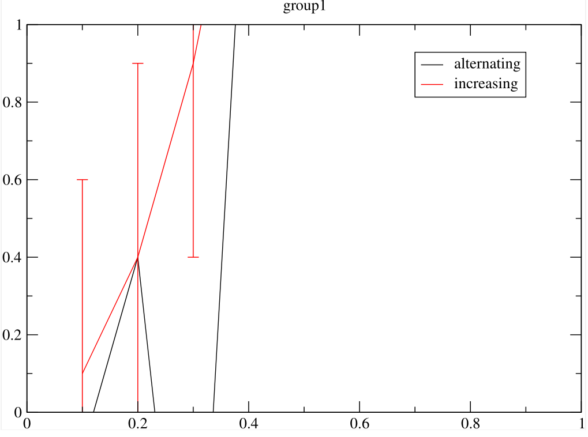
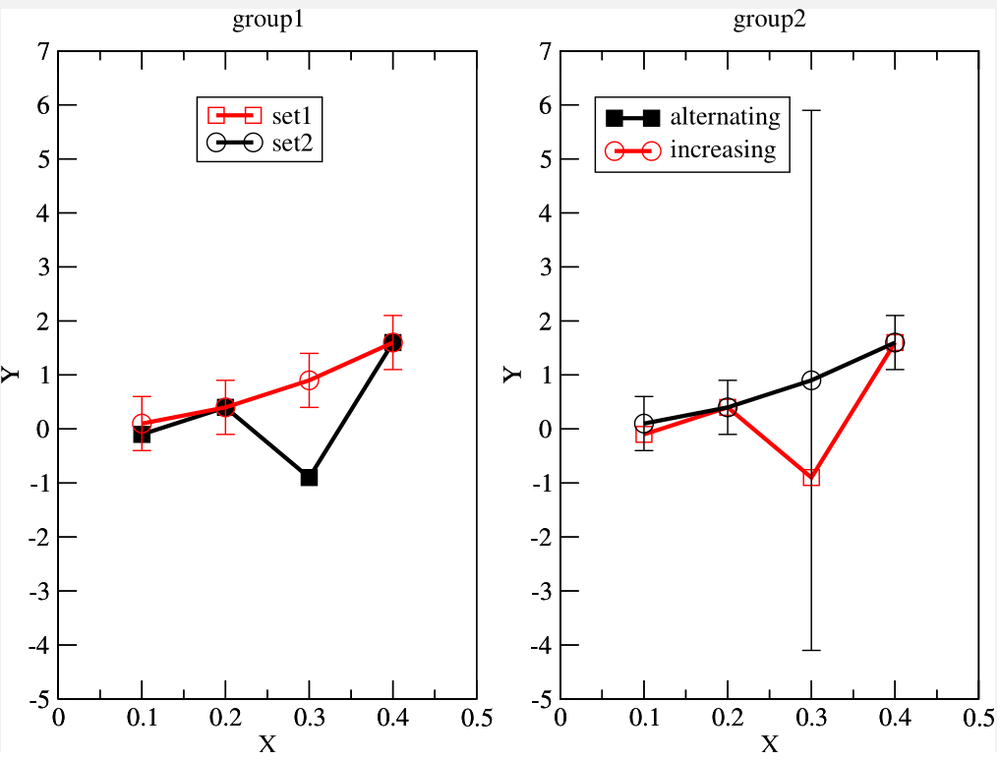

# SimpleGrace

This is a stand-alone utility file that wraps the XMGrace plotting software in a simple python interface.
You are meant to use this to generate the data portion of the .agr files, while you use the XMGrace GUI to change the visuals.
This allows you to use code to generate the data, but a GUI to design the aesthetics of your plots, that way you don't have to deal with cumbersome styling code.

## Overview
This implementation provides a single function call for plot generation.
Xmgrace is well-know for it's high quality and well-established use case in scientific plotting.
Although there are more complete packages, such as [pygrace](https://pypi.org/project/pygrace/),
the simplicity and ease of use are the key points here.

Despite the high quality plots, the functionality and ability to dynamically generate plots is difficult.
This provides a way to easily generate figures programmatically, leaving the graphical design to the xmgrace GUI.
Additionally, to reduce errors, the data generating code should be connected directly to the graphing software,
so there are no 'translation' issues. So, the values are updated by this software, but the visuals must be done manually.

This facilitates a workflow where you programmatically generate the data, then work within the interface to set up the visuals.
If the data changes, running the function will update the data - not the visuals. It is ideal for the data to be generated, 
while a GUI is easier to use for the visuals.

## Example
Here is an example call:

```python
import simple_grace as grace

grace.Graph('testing.agr', "This is an example.", [
	("group1", [
		("alternating", 'xy', [
			(.1, -.1),
			(.2, .4),
			(.3, -.9),
			(.4, 1.6),
		]),
		("increasing", 'xydy', [
			(.1, .1, .5),
			(.2, .4, .5),
			(.3, .9, .5),
			(.4, 1.6, .5),
		])
	]),
	("group2", [
		("set1", 'xy', [
			(.1, -.1),
			(.2, .4),
			(.3, -.9),
			(.4, 1.6),
		]),
		("set2", 'xydy', [
			(.1, .1, .5),
			(.2, .4, .5),
			(.3, .9, 5),
			(.4, 1.6, .5),
		])
	])
])
```

This is what it looks like when first renders. Notice only one group shows, and clearly some editing is required.


This is what it looks like after a few minutes of formatting in the XMGrace interface.


## Limitations

There are some considerations when adding/removing groups or sets after the initial generation.

- When removing groups/sets, there will be vestigial @lines regarding that group/set's formatting
- In addition to this, the formatting may get shifted: if S0 is deleted, S1 may have the aesthetics of the now removed S0.
- It may take two passes to update the legend.
- It is best to know the shape of the final plot upfront.
